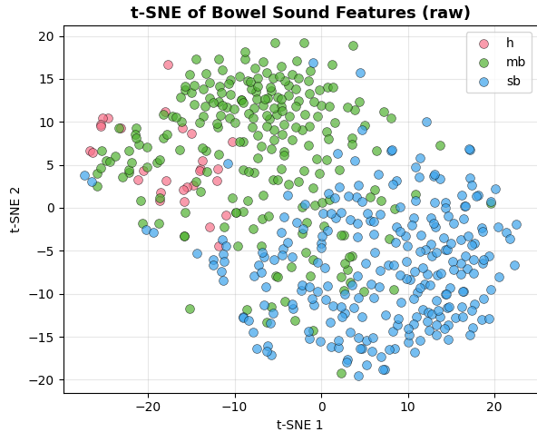

## Approach

We turn raw audio + strong labels (onset, offset, class ∈ {b, mb, h}) into frame-level targets, train a compact CRNN on log-mel features, then post-process frame probabilities into events with thresholding / gap merge and min-duration rules.

---

### 1) 10-second segments → features & label spans

We work on 10-second analysis windows for quick visualization/debugging. Audio is high-pass filtered (60 Hz), transformed to log-mel (default 128×T), and labels are drawn as a Gantt track.


*Waveform (top), standardized log-mel spectrogram (right), and label Gantt (bottom).*

**Notes**
- Sample rate: 16 kHz (configurable).
- Mel params: `n_mels=128`, `n_fft=1024`, `hop_length=320` (20 ms); configurable in `configs/spotter.yaml`.
- Frame time mapping: `t = frame_index * hop_length / sr`.

---

### 2) Collapsing to a binary track (BS vs NULL)

**preparation step for downstream classification**, we collapse multi-class labels into a single BS vs NULL track.  
Using a 50% overlap rule per frame (any bowel sound type present → BS=1), this simplifies the segmentation task and provides clean BS spans that can then be passed to a classifier to distinguish between {b, mb, h}.  


*Green bars = frames labeled as “BS”.*

---

### 3) Frame probabilities + threshold

The CRNN outputs per-class frame probabilities. We inspect the probability track and apply a decision threshold .  


*Dashed line = decision threshold.*

**Post-processing (configurable)**
- `threshold`: float or list per class
- `min_gap_s`: merges two same-class islands if the silent gap is shorter than this
- `min_dur_s`: removes very short events

These parameters can also be **learned or optimized via statistical analysis on larger BS datasets or guided by prior research.**


These map probabilities → binary masks → merged events with clean onsets/offsets.

---


### 5) Training curve snapshot

| Epoch | Train Loss | Val Loss | FW-F1   | Precision | Recall |
|------:|------------|----------|------|-----------|--------|
| 01    | 0.5101     | 0.4563   | 0.242 | 0.919     | 0.139 |
| 02    | 0.4002     | 0.3581   | 0.727 | 0.783     | 0.679 |
| 03    | 0.3776     | 0.5387   | 0.670 | 0.524     | 0.929 |
| …     | …          | …        | …     | …         | …     |
| 09    | 0.3071     | 0.3039   | 0.772 | 0.846     | 0.710 |
| 10    | 0.2884     | 0.2905   | 0.810 | 0.776     | 0.847 |

*FW-F1 = framewise F1 computed per frame (hop ≈ 10 ms, window ≈ 25 ms), so temporal resolution is ~10 ms ..*


---

### 4) Predicted events vs Ground Truth

We visualize predicted spans against GT to see timing agreement, merges/splits, and misses at a glance.


*Top = GT spans, bottom = predicted spans after post-processing.*

---


**Key knobs in `configs/spotter.yaml`:**
```yaml
features:
  n_mels: 128
  n_fft: 1024
  hop_length: 320
postprocess:
  threshold: 0.5
  min_dur_s: 0.08
  min_gap_s: 0.05
```

## t-SNE visualization



This plot (from `analysis/explore_tsne.py`) shows good class separation .  
Separation comes from combining temporal stats and spectral descriptors that capture both "burst shape" and frequency content, giving the features strong discriminative power.  


## TODO (next steps)


- Document and integrate spectral feature extraction (e.g., MFCCs, spectral centroid/rolloff/entropy) for each BS event to support classification.
